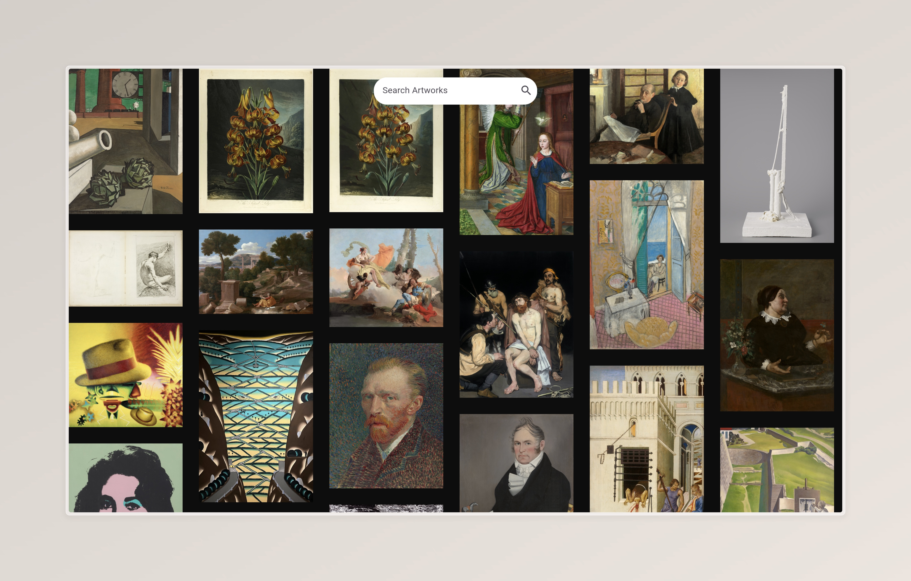
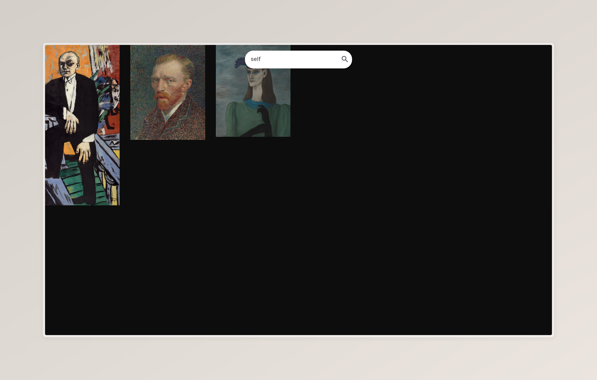
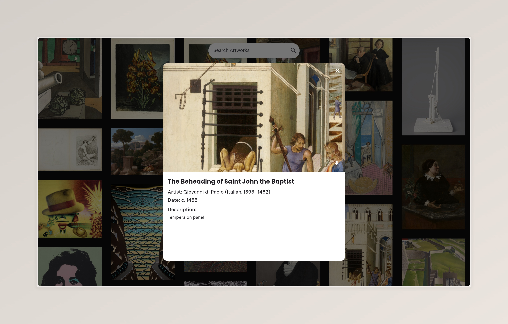

# Artworks Images

A Flutter application that allows users to browse and search for artworks from the Art Institute of Chicago's API. The app features a responsive design, image downloading capabilities, and efficient state management using the GetX package.

## Features

- Browse a collection of artworks.
- Search for artworks by title or keyword.
- Pagination support for loading more artworks.
- Download images directly to the device.
- Responsive design for both web and mobile platforms.

## Technologies Used

- Flutter
- Dart
- GetX for state management
- HTTP package for API calls
- CanvasKit for rendering on the web

## Installation

To get started with this project, follow these steps:

1. **Clone the repository:**

   ```bash
   git clone https://github.com/yourusername/artworks_images.git
   cd artworks_images
   ```

2. **Install dependencies:**

   Make sure you have Flutter installed on your machine. Then run:

   ```bash
   flutter pub get
   ```

3. **Run the application:**

   You can run the app on an emulator or a physical device:

   ```bash
   flutter run
   ```

   For web, ensure you have the web environment set up and run:

   ```bash
   flutter run -d chrome
   ```

## Usage

1. **Browse Artworks:**
   - The app will display a list of artworks fetched from the Art Institute of Chicago's API.

2. **Search for Artworks:**
   - Use the search bar to filter artworks by title or keyword.

3. **Load More Artworks:**
   - Scroll to the bottom of the list to automatically fetch more artworks.

4. **Download Images:**
   - Click on the download button next to an artwork to save the image to your device.

## Screenshots

Here are some screenshots of the application:


*Home Screen displaying a list of artworks.*


*Search functionality in action.*


*Detail view of a selected artwork.*

*(Make sure to replace the image paths with the actual paths to your screenshots.)*

## Live Demo

You can view the live demo of the application at the following link:

[Live Demo](https://artwork-images.netlify.app/)


## Contributing

Contributions are welcome! If you have suggestions for improvements or new features, please fork the repository and submit a pull request.

1. Fork the repository.
2. Create your feature branch (`git checkout -b feature/YourFeature`).
3. Commit your changes (`git commit -m 'Add some feature'`).
4. Push to the branch (`git push origin feature/YourFeature`).
5. Open a pull request.

## License

This project is licensed under the MIT License - see the [LICENSE](LICENSE) file for details.

## Acknowledgments

- [Art Institute of Chicago API](https://www.artic.edu/open-access/public-domain-artworks) for providing access to the artwork data.
- [Flutter](https://flutter.dev/) for the framework.
- [GetX](https://pub.dev/packages/get) for state management.
